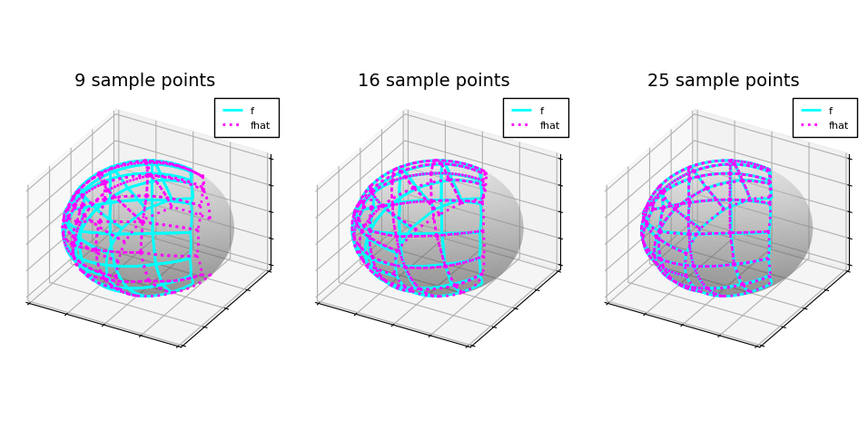
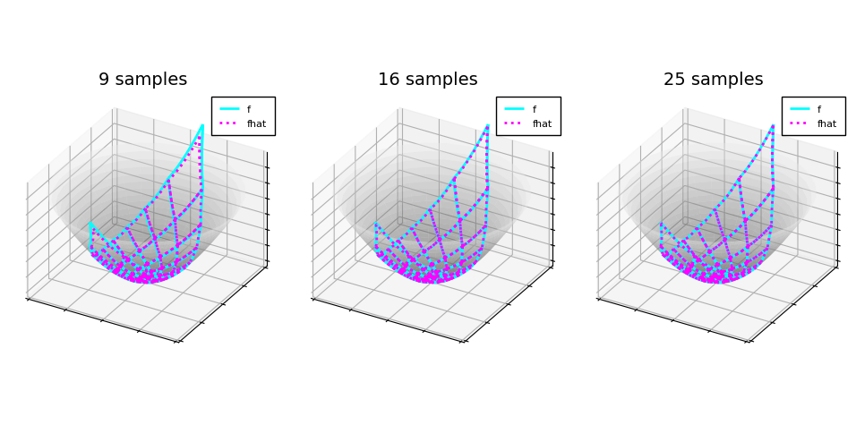

# Approximating maps into manifolds

Approximate functions of type $$\mathbb{R}^m \to M^n$$ where $M^n$ is an $n$-dimensional Riemannian manifold manifold.

Depends on `ApproximatingMapsBetweenLinearSpaces.jl`, which is available at TODO.

## Example 1

Approximate
$$f \colon [-1, 1]^2 \to S^2, (x, y) \mapsto \mathrm{stereographic~projection}(x^2 - y^2, 2 x y)$$
using a varying number of sample points.
This figure illustrates the approximation accuracy by showing the image on $S^2$ of a grid in $[-1, 1]^2$:

## Example 2

Approximate
$$f \colon [-1, 1]^2 \to H^2, (x, y) \mapsto \mathrm{stereographic~projection}(x^2 - y^2, 2 x y)$$
using a varying number of sample points.
This figure illustrates the approximation accuracy by showing the image on $H^2$ of a grid in $[-1, 1]^2$:

## Example 3

Approximate
$$f \colon [-1, 1]^3 \to \mathrm{Segre}(30, 30), x \mapsto \frac{\exp{x_1}}{2} \exp{-W_1 x_2} \mathbb{1} (\exp{-W_2 x_3} \mathbb{1})^\mathrm{T}$$
where $W_1$ and $W_2$ are randomly chosen antisymmetric $30 \times 30$ matrices and $\mathbb{1} = (1, 0, \dots, 0)$.
This figure illustrates the approximation accuracy compared to what is predicted by the theory:

TODO: cite article.
